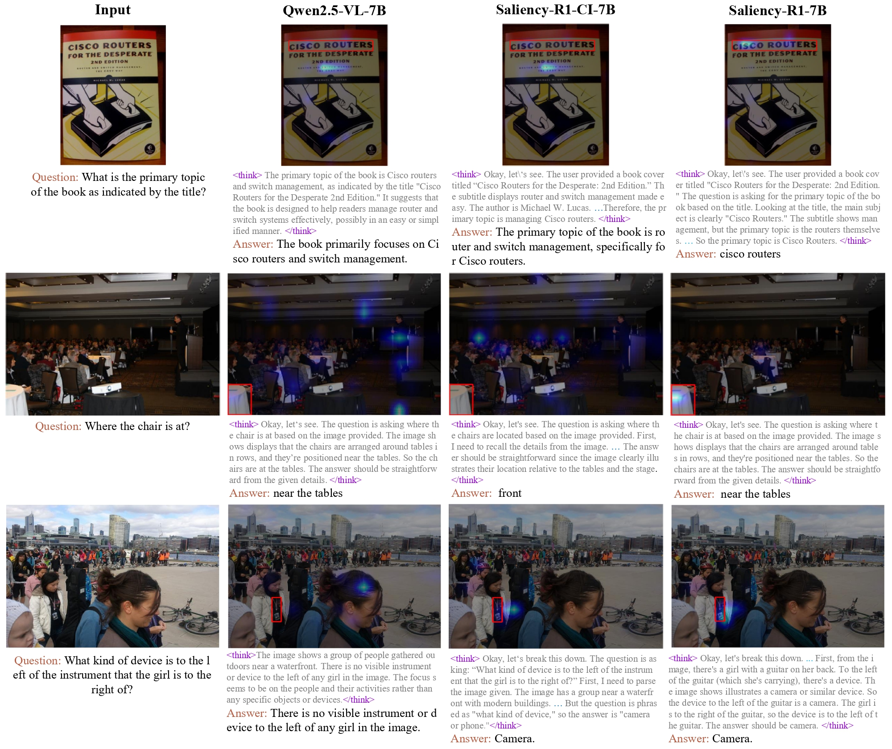

# Saliency-R1: Enforcing Interpretable and Faithful  Vision-language Reasoning via Saliency-map Alignment Reward

Implementation for CVPR 2026 paper [Saliency-R1: Enforcing Interpretable and Faithful  Vision-language Reasoning via Saliency-map Alignment Reward](http://arxiv.org/abs/2604.04500)
by [Shizhan Gong](https://peterant330.github.io/), [Minda Hu](https://scholar.google.com/citations?user=uQlkNn8AAAAJ&hl=zh-CN), [Qiyuan Zhang](https://scholar.google.com/citations?user=7LZAo0EAAAAJ&hl=zh-CN), [Chen Ma](https://allenjack.github.io/), and [Qi Dou](https://www.cse.cuhk.edu.hk/~qdou/).



## Model and Data

We release the training data and pretrained models through hugging face.

- Model:  [Saliency-R1-3B](https://huggingface.co/peterant330/Saliency-R1-3B), [Saliency-R1-7B](https://huggingface.co/peterant330/Saliency-R1-7B).
- Dataset: [Saliency-R1-cold](https://huggingface.co/datasets/peterant330/Saliency-R1-cold), [Saliency-R1-cold](https://huggingface.co/datasets/peterant330/saliency-r1-8k).

## Environment
We recommend to install the environment through conda:
```commandline
conda env create -f trl.yaml
```
or 
```commandline
pip install -r requirements.txt
```

## Supervised Fine-tuning

- Download the cold-start data through https://huggingface.co/datasets/peterant330/code_start_data
- unzip the data file through `tar -xvf saliency_r1.tar`, which results in a folder called `saliency_r1_data_filt`.
- Install [llama-factory](https://github.com/hiyouga/LLaMA-Factory). 
```commandline
git clone --depth 1 https://github.com/hiyouga/LLaMA-Factory.git
cd LLaMA-Factory
pip install -e ".[torch,metrics]" --no-build-isolation
```
- Replace the `dataset_dir` in `train/cold_start/vision_r1_full_Qwen2.5-VL-7B-Instruct_sft_epoch2_lr5e6_warm005_8GPU/train.yaml` with `path/to/saliency_r1_data_filt` (the saving directory of the previous step).
- Start training
```commandline
llamafactory-cli train train/cold_start/vision_r1_full_Qwen2.5-VL-7B-Instruct_sft_epoch2_lr5e6_warm005_8GPU/train.yaml
```

## GRPO

1. To enable attention weight outputs, we revised the attention generation function and correspondingly adjusted the transformer's attention scripts.

- Replacing `sdpa_attention.py` in `~/anaconda3/envs/{env_name}/lib/python3.10/site-packages/transformers/integrations` with the one we provided.
- Replacing `modeling_qwen2_5_vl.py` in ``~/anaconda3/envs/trl/lib/python3.10/site-packages/transformers/models/qwen2_5_vl` with the one we provided.

2. Then clone the `trl` repository. We use the version `0.21.0`
```commandline
git clone --branch v0.21-release --depth 1 --single-branch https://github.com/huggingface/trl.git
```
Also to support Saliency-R1 post-training, we need to modify several files:

- put `trl/grpo_trainer.py` (in this repo) under `trl/trl/trainer/grpo_trainer.py` (the cloned trl repo)
- put  all files within `trl/rewards` under   `trl/trl/rewards`
- put  `trl/grpo_vlm.py` under `trl/examples/scripts`
- put   `trl/__init__.py` under `trl/trl` 
- remember to add the `api_key` in `trl/trl/rewards/openai_rewards.py` if you want to use LLM-as-judge.

3. Setup environmental variable to support huggingface downloading and WandB.
```commandline
export HF_TOKEN=xxx
export WANDB_API_KEY=xxx
```
4. Running script
```commandline
accelerate launch     --config_file examples/accelerate_configs/deepspeed_zero3.yaml  examples/scripts/grpo_vlm.py \    
--model_name_or_path peterant330/Saliency-R1-CI-v2 --attn_implementation sdpa  \
--output_dir ../checkpoint/grpo-Qwen2.5-VL-7B-Instruct-saliency-R1     --learning_rate 1e-5   \
--repetition_penalty 1.05 --torch_dtype bfloat16     --max_prompt_length 1024     \
--max_completion_length 512     --use_peft     --lora_target_modules "q_proj", "v_proj" \
--log_completions      --per_device_train_batch_size 4     --gradient_accumulation_steps 2    \
--num_generations 8 --report_to wandb --save_steps 200 --num_train_epochs 3 --temperature 1
```

`model_name_or_path` can be the original Qwen base model, or the model after supervised fine-tuning. We also provide our sft version in [peterant330/Saliency-R1-CI](https://huggingface.co/peterant330/Saliency-R1-CI).

## Evaluation

We use [lmms-eval](https://github.com/evolvinglmms-lab/lmms-eval) for evaluation.

## Bibtex
If you find this work helpful, you can cite our paper as follows:

```commandline
@article{gong2026saliency,
  title={Saliency-R1: Enforcing Interpretable and Faithful  Vision-language Reasoning via Saliency-map Alignment Reward},
  author={Gong, Shizhan and Hu, Minda and Zhang, Qiyuan and Ma, Chen and Dou, Qi},
  journal={arXiv preprint arXiv:2604.04500},
  year={2026}
}
```

## Contact

For any questions, please contact [szgong22@cse.cuhk.edu.hk](szgong22@cse.cuhk.edu.hk).

